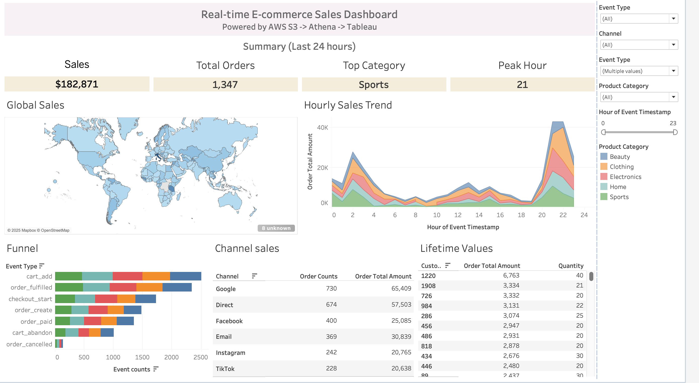

# E-commerce Real-Time + Batch Data Lakehouse (AWS)
A production-style Data Engineering project that ingests synthetic e-commerce events, lands them in an S3 data lake, processes them with AWS Glue, and visualizes insights in Tableau through Amazon Athena.

##  Architecture Overview


### **1.  Source + Ingestion Layer**
Event data is generated using:
- **AWS Lambda** (scheduled event generator)
- **Kinesis Data Streams** (real-time ingestion)
- **Kinesis Firehose** (delivery to S3 Raw)

### **2. Storage Layer**
Raw JSON events are stored in:
- **S3 Raw Zone**
  - unmodified event payloads  
  - date/event based partitioning  
  - lifecycle policies for cost optimization  
- **Glue Data Catalog** (metadata)

### **3. ETL & Governance — Silver Zone (Clean Parquet)**
- Convert **JSON → Parquet**
- Enforce data types & timestamp formats  
- Validate data with **Glue Data Quality**
- Update schemas via **Glue Crawler**

Output:
- **S3 Silver Zone**
  - optimized for Athena + BI tools  

### **4. Consumption Layer — Athena + Tableau**
The Silver Zone is queried using:
- **Amazon Athena** (serverless SQL)

## Example Data Flow 

To illustrate how event data flows through the pipeline.

1. **Raw JSON Event (S3 Raw Zone):**
   - This is a single event emitted by the system
   - Example fields include:  
     - `event_id`, `event_type`, `session_id`, `event_timestamp`
     - Nested: `customer`, `order`, `session`, etc.

   ```json
   {
     "event_id": "bf68c524-79a3-4367-9cc2-5730e6f2ed86",
     "event_type": "order_paid",
     "session_id": "...",
     "event_timestamp": "...",
     "customer": { ... },
     "order": { ... },
     "session": { ... }
   }
   ```

2. **ETL Transformation**
   - Glue jobs parse, clean, and normalize the raw event data:
     - Convert timestamps into proper formats
     - Join/flatten nested structures
     - Validate/enforce data types

3. **Processed ("Silver") Table**
   - **Parquet** table in S3.
   

   | event_id        | event_type | session_id | event_timestamp       | customer_id | country    | order_id       | product_id | product_name      | order_item_qty |
   |-----------------|------------|------------|----------------------|-------------|------------|---------------|------------|-------------------|----------------|
   | bf68c5...ed86   | order_paid | ba8032...  | 2025-12-09 00:09:02  | 1326        | Afghanistan| 1ed960ec...    | 103        | USB-C Cable 6ft   | 2              |

4. **Query/BI Layer:**
   - Analysts query the Silver table in **Athena** or visualize in **Tableau**.
   - Aggregations like total orders by country, average order value, etc. are now easy and performant.

## Real-Time E-commerce Sales Dashboard (Tableau + Athena)


This dashboard is powered directly from the **Silver Parquet Zone** in S3, queried through **Amazon Athena**.  

### Key Features
- **Global Sales Heatmap**  
  Visualizes worldwide order distribution by customer location.

- **Hourly Sales Trend**  
  Real-time revenue pattern by product category, showing peaks in engagement and purchasing behavior.

- **Customer Lifetime Value Table**  
  Aggregated order totals and quantities per customer.

- **E-commerce Funnel Breakdown**  
  Counts of all event types (product_view → cart → checkout → order_paid).

- **Marketing Channel Performance**  
  Order counts and revenue grouped by acquisition channel.
