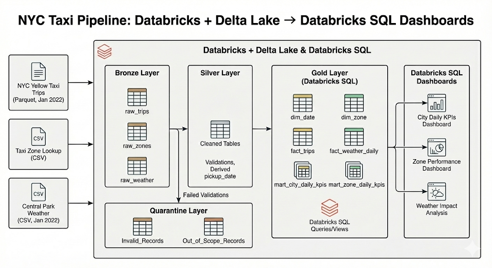
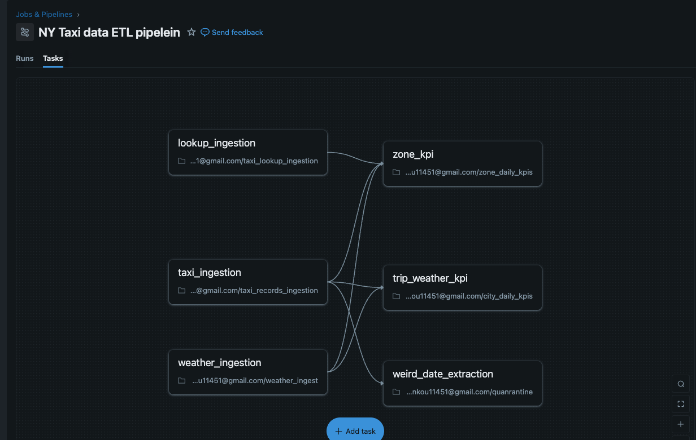
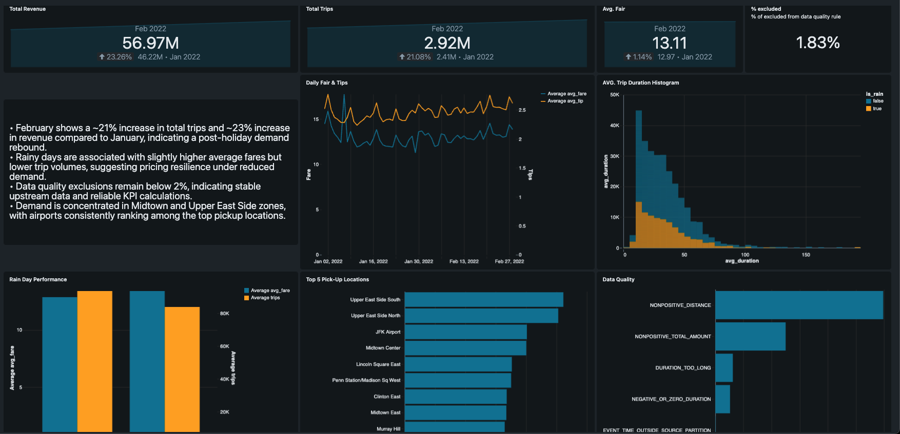

# NYC Taxi Demand & Weather Dashboard

## Overview
This project implements a production-style Databricks Lakehouse pipeline to analyze NYC taxi demand and revenue patterns with daily weather data. The pipeline ingests public datasets, applies data quality validation, and produces KPI marts consumed by dashboards.

## What this project demonstrates
- **Lakehouse design:** Bronze → Silver → Gold (raw → standardized/DQ → marts)
- **Orchestration:** end-to-end ETL automated via a **Databricks Job**
- **Data Quality:** validation rules + **quarantine table** and DQ monitoring
- **Analytics delivery:** city/zone daily KPI marts + weather metrics

## Workflow
The pipeline follows a Bronze → Silver → Gold design pattern:

- Bronze: Raw ingestion of NYC TLC Yellow Taxi trip data and NOAA daily weather data, partitioned by year and month
- Silver: Cleaned and standardized tables with data quality validation
- Gold: Aggregated KPI marts for analytics and dashboard 

- Invalid or out-of-scope records are quarantined, enabling transparency and data quality monitoring.

*The diagram above illustrates the ETL pipeline orchestrated by a Databricks job, which automates data ingestion, transformation, and loading throughout the Lakehouse workflow.*

## ETL pipeline

### Extract (Bronze)
**Sources**
- NYC TLC Yellow Taxi trip data
- NOAA daily weather data

**Ingestion**
- Land raw data into **Bronze Delta tables** using **Databricks Auto Loader** (`cloudFiles` format)
- Auto Loader provides scalable, incremental file ingestion with automatic schema inference
- **Schema management:** `cloudFiles.schemaLocation` tracks schema changes; `cloudFiles.schemaEvolutionMode` handles schema evolution automatically
- **Incremental processing:** `Trigger.AvailableNow()` enables efficient batch-like processing of only new files since the last run
- Partition by year/month for scalable reads and incremental refreshes

**Outputs (example tables)**
- bronze.taxi_trips_raw
- bronze.weather_daily_raw

---

### Transform + Validate (Silver)
**Standardization**
- Cast timestamps and numeric fields, normalize column names/types
- Derive fields used downstream 
- (Optional) deduplicate records if repeated loads occur

**Data Quality + Quarantine**
- Apply validation rules (timestamps, duration/distance bounds, non-negative monetary values, partition consistency)
- Route failed records to a **quarantine Delta table** with a failure_reason for monitoring and debugging

**Outputs (example tables)**
- silver.taxi_trips_clean
- silver.weather_clean
- silver.quarantine_trips

---

### Load (Gold)
**KPI marts**
- Build analytics-ready aggregates designed for dashboard queries

**Outputs (example marts)**
- gold.kpi_city_daily
- gold.kpi_zone_daily
- gold.kpi_weather_impact_daily
- gold.dq_metrics_daily

## Data Quality
The Silver layer enforces multiple validation rules, including:

- Valid pickup and dropoff timestamps
- Reasonable trip durations and distances
- Non-negative monetary values
- Event-time consistency with source partitions

Records failing these checks are written to a quarantine table

## Analytics
The Gold layer provides the following analytics-ready tables:

### City-level daily KPIs

- Total trips
- Revenue
- Average fare, tip, distance, and duration
  
### Zone-level daily KPIs
- Demand and revenue by pickup zone and borough
- Weather-enriched daily metrics

### Data quality metrics
- Percentage of records excluded
- Breakdown by exclusion reason
  
## Dashboard

The dashboard highlights demand trends, revenue performance, weather impacts, and data quality health to support analytical and operational insights.