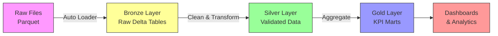

# Building a Production-Grade ETL Pipeline in Databricks: A Complete Guide

Welcome! This guide will walk you through building a real-world ETL (Extract, Transform, Load) pipeline using Databricks and Apache Spark. We'll be processing NYC Yellow Taxi trip data using the **Lakehouse architecture** pattern: Bronze → Silver → Gold.

> [!NOTE]
> This tutorial is designed for data engineering learners. We'll explain every concept, pattern, and line of code to help you understand not just *what* the code does, but *why* we write it this way.

## Table of Contents
1. [Understanding the Lakehouse Architecture](#understanding-the-lakehouse-architecture)
2. [Bronze Layer: Data Ingestion with Auto Loader](#bronze-layer-data-ingestion-with-auto-loader)
3. [Silver Layer: Data Cleaning and Transformation](#silver-layer-data-cleaning-and-transformation)
4. [Gold Layer: Analytics-Ready Aggregations](#gold-layer-analytics-ready-aggregations)
5. [Best Practices and Production Patterns](#best-practices-and-production-patterns)

---

## Understanding the Lakehouse Architecture

### What is the Medallion Architecture?

The **Medallion Architecture** (Bronze → Silver → Gold) is a data design pattern that progressively improves data quality as it moves through layers:

- **Bronze (Raw)**: Stores data exactly as received from source systems
- **Silver (Cleaned)**: Validated, deduplicated, and standardized data
- **Gold (Aggregated)**: Business-level aggregates ready for analytics and reporting

### Why Use This Pattern?

1. **Data Lineage**: Easy to trace data from source to final reports
2. **Reprocessing**: Can rebuild downstream layers if business logic changes
3. **Quality Gates**: Each layer enforces quality checks before promoting data
4. **Performance**: Downstream queries run faster on pre-aggregated Gold tables

---

## Bronze Layer: Data Ingestion with Auto Loader

### Overview

The Bronze layer ingests raw NYC taxi trip data from cloud storage into Delta Lake tables. We use **Databricks Auto Loader** for scalable, incremental file processing.

### The Code: Step by Step

#### 1. Reading Raw Data (Batch Mode)

```python
from pyspark.sql import functions as F

raw_root = "/Volumes/project/default/my_data_volume/yellow_trips"

raw = (
    spark.read
      .format("parquet")
      .option("basePath", raw_root)   
      .load(f"{raw_root}/year=*/month=*")
)

display(raw.limit(10))
```

**What's happening here?**

- `spark.read.format("parquet")`: Tells Spark we're reading Parquet files (a columnar storage format)
- `option("basePath", raw_root)`: Sets the base path so Spark can infer partition columns
- `load(f"{raw_root}/year=*/month=*")`: Uses wildcard pattern to read all partitions
- The data is partitioned by `year` and `month` folders (e.g., `year=2022/month=01/`)

> [!TIP]
> **Partitioning** organizes data into folders based on column values. This allows Spark to skip reading irrelevant files when filtering by partition columns, dramatically improving query performance.

#### 2. Setting Up Infrastructure

```python
%sql
CREATE SCHEMA IF NOT EXISTS project.infra;
CREATE VOLUME IF NOT EXISTS project.infra.checkpoints;
```

**Why do we need this?**

- **Schemas**: Organize tables into logical groups (like databases)
- **Volumes**: Unity Catalog managed storage locations for checkpoints and metadata
- **Checkpoints**: Track which files have been processed to enable incremental loading

#### 3. Auto Loader: Production-Grade Streaming Ingestion

```python
from pyspark.sql import functions as F

source_path = "/Volumes/project/default/my_data_volume/yellow_trips/"
schema_path = "/Volumes/project/infra/checkpoints/taxi/schema"
checkpoint_path = "/Volumes/project/infra/checkpoints/taxi/data"

df = (
    spark.readStream
        .format("cloudFiles")
        .option("cloudFiles.format", "parquet")
        .option("cloudFiles.schemaLocation", schema_path)
        .option("cloudFiles.schemaEvolutionMode", "addNewColumns")
        .option("cloudFiles.inferColumnTypes", "true")
        .option("cloudFiles.includeExistingFiles", "true")
        .option("rescuedDataColumn", "_rescued_data")
        .load(source_path)
        .select(
            "*",
            F.col("_metadata.file_path").alias("source_file"),
            F.col("_metadata.file_modification_time").alias("source_file_mod_time")
        )
        .withColumn("ingest_ts", F.current_timestamp())
        .withColumn(
            "tpep_pickup_datetime",
            F.col("tpep_pickup_datetime").cast("timestamp")
        )
        .withColumn("year", F.year("tpep_pickup_datetime"))
        .withColumn("month", F.month("tpep_pickup_datetime"))
)
```

**Let's break down each option:**

| Option | Purpose | Why It Matters |
|--------|---------|----------------|
| `format("cloudFiles")` | Enables Auto Loader | Automatically detects new files and processes only what's new |
| `cloudFiles.format` | Source file format | Tells Auto Loader we're reading Parquet files |
| `cloudFiles.schemaLocation` | Where to store schema | Tracks schema changes over time for schema evolution |
| `cloudFiles.schemaEvolutionMode` | How to handle schema changes | `addNewColumns` automatically adds new columns when source schema changes |
| `cloudFiles.inferColumnTypes` | Auto-detect data types | Automatically infers the best data type for each column |
| `cloudFiles.includeExistingFiles` | Process existing files on first run | Ensures we don't miss files that existed before the stream started |
| `rescuedDataColumn` | Capture unparseable data | Rows that don't match the schema go into `_rescued_data` instead of failing |

**Metadata Columns:**

```python
F.col("_metadata.file_path").alias("source_file")
F.col("_metadata.file_modification_time").alias("source_file_mod_time")
```

These capture **data lineage** - we can trace each record back to its source file and when it was modified. This is critical for debugging and auditing.

**Audit Columns:**

```python
.withColumn("ingest_ts", F.current_timestamp())
```

Adds a timestamp showing when the data was ingested into our system. Essential for tracking data freshness.

#### 4. Writing to Delta Lake with Streaming

```python
query = (
    df.writeStream
        .format("delta")
        .option("checkpointLocation", checkpoint_path)
        .option("mergeSchema", "true")
        .partitionBy("year", "month")
        .trigger(availableNow=True)
        .queryName("autoloader_taxi_bronze")
        .toTable("project.taxi_bronze.trips_raw")
)

query.awaitTermination()

print("Stream completed successfully!")
```

**Understanding Structured Streaming:**

| Component | Explanation |
|-----------|-------------|
| `writeStream` | Creates a streaming write operation |
| `format("delta")` | Write to Delta Lake format (ACID transactions, time travel, schema enforcement) |
| `checkpointLocation` | Stores progress - which files have been processed |
| `mergeSchema` | Allows schema to evolve automatically |
| `partitionBy("year", "month")` | Organizes data into folders by year and month |
| `trigger(availableNow=True)` | **Incremental batch mode** - processes all available data then stops |
| `toTable()` | Writes to a managed Delta table |

> [!IMPORTANT]
> **Why `trigger(availableNow=True)`?**
> 
> This is a game-changer for production pipelines:
> - Processes all new files since the last run
> - Stops automatically when done (unlike continuous streaming)
> - Perfect for scheduled jobs (e.g., hourly, daily)
> - More cost-effective than always-on streaming

**The Checkpoint Mechanism:**

Auto Loader maintains state in the checkpoint location:
- Tracks which files have been processed
- Stores schema evolution history
- Enables exactly-once processing guarantees
- Allows resuming from failures without reprocessing

---

## Silver Layer: Data Cleaning and Transformation

The Silver layer takes raw Bronze data and applies:
- Data type conversions
- Data quality filters
- Derived columns
- Schema standardization

### The Code: Step by Step

```python
spark.sql('''
    DROP TABLE IF EXISTS project.taxi_silver.trips ;
''')

bronze_df = spark.table("project.taxi_bronze.trips_raw")
```

**Starting fresh:** We drop the existing Silver table (if any) and read from Bronze.

### Visual Data Flow: Bronze Layer Sample

Let's look at actual data from the Bronze layer to understand what we're working with:

**Sample Bronze Records** (`project.taxi_bronze.trips_raw`):

| VendorID | tpep_pickup_datetime | tpep_dropoff_datetime | passenger_count | trip_distance | RatecodeID | store_and_fwd_flag | PULocationID | DOLocationID | payment_type |
|----------|---------------------|----------------------|-----------------|---------------|------------|-------------------|--------------|--------------|--------------|
| 2 | 2022-03-09T04:48:40.000 | 2022-03-09T04:58:27.000 | 4 | 2.88 | 1 | N | 164 | 140 | 1 |
| 2 | 2022-03-15T20:10:18.000 | 2022-03-15T20:20:25.000 | 2 | 1.7 | 1 | N | 161 | 143 | 2 |
| 2 | 2022-03-15T20:34:06.000 | 2022-03-15T20:41:58.000 | 3 | 1.12 | 1 | N | 142 | 163 | 1 |
| 2 | 2022-03-15T20:47:56.000 | 2022-03-16T04:00:49.000 | 2 | 1.88 | 1 | N | 162 | 236 | 1 |
| 2 | 2022-03-01T13:16:00.000 | 2022-03-01T13:20:11.000 | 2 | 0.75 | 1 | N | 79 | 4 | 1 |

**Observations about Bronze data:**
- ✅ Raw column names from source (`tpep_pickup_datetime`, `PULocationID`)
- ✅ Timestamps stored as strings
- ✅ All source columns preserved
- ⚠️ No derived columns yet
- ⚠️ No data quality validation applied

### Transformation Example: Single Record Journey

Let's trace one record through the Bronze → Silver transformation:

**Before (Bronze):**
```
VendorID: 2
tpep_pickup_datetime: "2022-03-09T04:48:40.000"  ← String
tpep_dropoff_datetime: "2022-03-09T04:58:27.000" ← String
PULocationID: 164                                 ← Raw column name
DOLocationID: 140                                 ← Raw column name
passenger_count: 4
trip_distance: 2.88
```

**After (Silver):**
```
pickup_ts: 2022-03-09T04:48:40.000               ← Timestamp type
dropoff_ts: 2022-03-09T04:58:27.000              ← Timestamp type
pickup_date: 2022-03-09                          ← NEW: Derived
pickup_hour: 4                                    ← NEW: Derived
pickup_location_id: 164                          ← Renamed
dropoff_location_id: 140                         ← Renamed
passenger_count: 4
trip_distance: 2.88
trip_minutes: 9.78                               ← NEW: Calculated
```

**What happened?**
1. ✅ Timestamps converted from strings to proper timestamp types
2. ✅ Derived `pickup_date` and `pickup_hour` for easier querying
3. ✅ Calculated `trip_minutes` = (dropoff - pickup) / 60
4. ✅ Renamed columns to follow consistent naming conventions
5. ✅ Applied data quality filters (this record passed all checks)


### Data Transformations

```python
silver = (
    bronze_df
    # Convert to proper timestamp types
    .withColumn("pickup_ts", F.to_timestamp("tpep_pickup_datetime"))
    .withColumn("dropoff_ts", F.to_timestamp("tpep_dropoff_datetime"))
    
    # Derive date and time components
    .withColumn("pickup_date", F.to_date("pickup_ts"))
    .withColumn("pickup_hour", F.hour("pickup_ts"))
    
    # Extract partition values for validation
    .withColumn("pickup_year", F.year("pickup_ts"))
    .withColumn("pickup_month", F.month("pickup_ts"))
    
    # Calculate trip duration in minutes
    .withColumn(
        "trip_minutes",
        (F.unix_timestamp("dropoff_ts") - F.unix_timestamp("pickup_ts")) / 60.0
    )
```

**Why these transformations?**

1. **Type Safety**: Converting strings to timestamps enables date arithmetic
2. **Derived Columns**: Pre-computing `pickup_date` and `pickup_hour` speeds up downstream queries
3. **Business Metrics**: `trip_minutes` is more intuitive than calculating from timestamps every time

### Data Quality Filters

```python
    # Data quality filters
    .filter(F.col("pickup_ts").isNotNull())
    .filter(F.col("dropoff_ts").isNotNull())
    .filter(F.col("trip_minutes").between(1, 240))  # 1 min to 4 hours
    .filter(F.col("trip_distance") > 0)
    .filter(F.col("total_amount") > 0)
    
    # Partition consistency check
    .filter(
        (F.col("pickup_year") == F.col("year")) &
        (F.col("pickup_month") == F.col("month"))
    )
```

**Understanding Each Filter:**

| Filter | Purpose | Business Logic |
|--------|---------|----------------|
| `pickup_ts.isNotNull()` | Ensure valid timestamps | Can't analyze trips without timestamps |
| `trip_minutes.between(1, 240)` | Remove outliers | Trips < 1 min or > 4 hours are likely errors |
| `trip_distance > 0` | Remove invalid trips | Zero-distance trips are data errors |
| `total_amount > 0` | Remove invalid fares | Negative or zero fares indicate bad data |
| Partition consistency | Data integrity | Ensures pickup time matches the partition folder |

> [!WARNING]
> **Production Tip**: In a real system, you'd send filtered-out records to a **quarantine table** with a `failure_reason` column. This enables:
> - Monitoring data quality metrics
> - Investigating systematic issues
> - Recovering data if filters were too strict

### Schema Standardization

```python
    # Select and rename columns to clean schema
    .select(
        "pickup_ts",
        "dropoff_ts",
        "pickup_date",
        "pickup_hour",
        F.col("PULocationID").cast("int").alias("pickup_location_id"),
        F.col("DOLocationID").cast("int").alias("dropoff_location_id"),
        F.col("passenger_count").cast("int"),
        F.col("trip_distance").cast("double"),
        F.col("fare_amount").cast("double"),
        F.col("tip_amount").cast("double"),
        F.col("total_amount").cast("double"),
        "trip_minutes",
        "year",
        "month"
    )
)
```

**Why standardize the schema?**

1. **Consistent Naming**: `pickup_location_id` is clearer than `PULocationID`
2. **Type Enforcement**: Explicit casting prevents type ambiguity
3. **Column Selection**: Only keep columns needed downstream (reduces storage and improves performance)

### Visual Data Flow: Silver Layer Sample

After applying all transformations and filters, here's what the Silver layer data looks like:

**Sample Silver Records** (`project.taxi_silver.trips`):

| pickup_ts | dropoff_ts | pickup_date | pickup_hour | pickup_location_id | dropoff_location_id | passenger_count | trip_distance | fare_amount | tip_amount |
|-----------|------------|-------------|-------------|-------------------|---------------------|-----------------|---------------|-------------|------------|
| 2022-01-15T09:31:51.000 | 2022-01-15T09:48:05.000 | 2022-01-15 | 9 | 138 | 224 | 1 | 9.01 | 25.5 | 3.33 |
| 2022-01-15T10:00:23.000 | 2022-01-15T10:16:09.000 | 2022-01-15 | 10 | 164 | 179 | 1 | 4.58 | 16.0 | 5.08 |
| 2022-01-15T10:55:12.000 | 2022-01-15T11:08:46.000 | 2022-01-15 | 10 | 138 | 170 | 1 | 8.31 | 23.5 | 7.12 |
| 2022-01-15T12:32:22.000 | 2022-01-15T13:02:07.000 | 2022-01-15 | 12 | 138 | 17 | 1 | 12.08 | 35.0 | 5.0 |
| 2022-01-15T13:45:53.000 | 2022-01-15T14:11:26.000 | 2022-01-15 | 13 | 138 | 100 | 1 | 8.67 | 29.5 | 8.22 |

**Key Improvements from Bronze → Silver:**
- ✅ Clean column names (`pickup_location_id` vs `PULocationID`)
- ✅ Proper data types (timestamps, not strings)
- ✅ Derived columns (`pickup_date`, `pickup_hour`, `trip_minutes`)
- ✅ Only valid records (data quality filters applied)
- ✅ Standardized schema (only necessary columns)

### Schema Evolution: Bronze vs Silver

**Silver Layer Schema** (`DESCRIBE project.taxi_silver.trips`):

| Column Name | Data Type | Comment |
|-------------|-----------|---------|
| `pickup_ts` | timestamp | Converted from string |
| `dropoff_ts` | timestamp | Converted from string |
| `pickup_date` | date | **Derived** - extracted from pickup_ts |
| `pickup_hour` | int | **Derived** - hour of day |
| `pickup_location_id` | int | Renamed from PULocationID |
| `dropoff_location_id` | int | Renamed from DOLocationID |
| `passenger_count` | int | Type enforced |
| `trip_distance` | double | Type enforced |
| `fare_amount` | double | Type enforced |
| `tip_amount` | double | Type enforced |
| `total_amount` | double | Type enforced |
| `trip_minutes` | double | **Derived** - calculated duration |
| `year` | int | Partition column |
| `month` | int | Partition column |

**Partition Information:**
- Partitioned by: `pickup_date`

> [!TIP]
> Notice how the Silver schema is **analytics-friendly**:
> - Derived columns (`pickup_date`, `pickup_hour`, `trip_minutes`) are pre-computed
> - Column names follow consistent naming conventions
> - Data types are explicitly enforced
> - Partitioning by `pickup_date` optimizes time-range queries


### Writing to Delta Lake

```python
(
    silver.write
      .format("delta")
      .mode("overwrite")
      .partitionBy("pickup_date")
      .saveAsTable("project.taxi_silver.trips")
)
```

**Key Decisions:**

- `mode("overwrite")`: Full refresh strategy (could use `append` or `merge` for incremental)
- `partitionBy("pickup_date")`: Partition by date for efficient time-range queries
- Delta format provides ACID transactions and time travel

---

## Gold Layer: Analytics-Ready Aggregations

The Gold layer creates pre-aggregated tables optimized for specific business questions. Common patterns include:

### Daily City-Level KPIs

```python
# Example Gold layer aggregation
gold_city_daily = (
    spark.table("project.taxi_silver.trips")
    .groupBy("pickup_date")
    .agg(
        F.count("*").alias("total_trips"),
        F.sum("total_amount").alias("total_revenue"),
        F.avg("fare_amount").alias("avg_fare"),
        F.avg("tip_amount").alias("avg_tip"),
        F.avg("trip_distance").alias("avg_distance"),
        F.avg("trip_minutes").alias("avg_duration")
    )
    .orderBy("pickup_date")
)

gold_city_daily.write
    .format("delta")
    .mode("overwrite")
    .saveAsTable("project.taxi_gold.kpi_city_daily")
```

### Visual Data Flow: Gold Layer - City-Level KPIs

**Sample City-Level Daily KPIs** (`project.taxi_gold.kpi_city_daily`):

| date | min_temp_c | max_temp_c | trips | revenue | avg_fare | avg_tip | avg_distance | avg_duration | rain_mm |
|------|------------|------------|-------|---------|----------|---------|--------------|--------------|---------|
| 2022-02-04 | -3.2 | 13.9 | 108,092 | $1,970,741.96 | $11.96 | $2.37 | 7.02 mi | 13.29 min | 18.3 |
| 2022-02-05 | -7.1 | -2.7 | 114,682 | $2,075,446.98 | $12.10 | $2.38 | 9.48 mi | 12.88 min | 0 |
| 2022-02-10 | 2.8 | 12.2 | 110,505 | $2,140,514.89 | $12.86 | $2.52 | 3.69 mi | 14.69 min | 0 |
| 2022-02-11 | 3.3 | 13.9 | 115,224 | $2,282,223.99 | $13.20 | $2.55 | 4.81 mi | 15.21 min | 0 |
| 2022-02-12 | 5.6 | 15.0 | 117,390 | $2,227,248.69 | $12.85 | $2.45 | 6.01 mi | 14.47 min | 0 |
| 2022-02-18 | -2.7 | 17.2 | 113,782 | $2,328,973.70 | $13.72 | $2.65 | 4.74 mi | 15.79 min | 8.4 |
| 2022-02-19 | -4.9 | 4.4 | 111,989 | $2,119,102.92 | $12.74 | $2.44 | 5.48 mi | 13.36 min | 0 |
| 2022-02-23 | 1.7 | 20.0 | 109,880 | $2,173,651.01 | $13.20 | $2.55 | 4.05 mi | 14.54 min | 0 |
| 2022-02-25 | -3.2 | 5.0 | 115,875 | $2,266,597.51 | $12.99 | $2.52 | 5.85 mi | 13.87 min | 18.8 |
| 2022-02-26 | -4.3 | 2.8 | 120,786 | $2,330,441.35 | $13.08 | $2.50 | 4.71 mi | 13.86 min | 0 |

**Key Insights from Gold Layer:**
- ✅ **Aggregated metrics**: Millions of individual trips → 10 daily summary rows
- ✅ **Weather enrichment**: Temperature and rainfall data joined for impact analysis
- ✅ **Business KPIs**: Revenue, average fare, tips, distance, duration all pre-calculated
- ✅ **Query performance**: Dashboards query 10 rows instead of 1M+ trip records
- 📊 **Analysis ready**: Notice Feb 5 had extreme cold (-7.1°C) but high trip distance (9.48 mi)


### Zone-Level Demand Analysis

```python
# Example: Pickup zone demand
gold_zone_daily = (
    spark.table("project.taxi_silver.trips")
    .groupBy("pickup_date", "pickup_location_id")
    .agg(
        F.count("*").alias("trip_count"),
        F.sum("total_amount").alias("revenue"),
        F.avg("trip_distance").alias("avg_distance")
    )
)

gold_zone_daily.write
    .format("delta")
    .mode("overwrite")
    .partitionBy("pickup_date")
    .saveAsTable("project.taxi_gold.kpi_zone_daily")
```

### Visual Data Flow: Gold Layer - Zone-Level KPIs

**Sample Zone-Level Daily KPIs** (`project.taxi_gold.kpi_zone_daily` for Feb 1, 2022):

| date | borough | zone | service_zone | trips | revenue | avg_fare | avg_tip | avg_distance | avg_duration | min_temp_c | max_temp_c |
|------|---------|------|--------------|-------|---------|----------|---------|--------------|--------------|------------|------------|
| 2022-02-01 | Manhattan | Union Sq | Yellow Zone | 2,452 | $42,238.63 | $11.01 | $2.37 | 2.23 mi | 13.49 min | -4.9 | 2.2 |
| 2022-02-01 | Manhattan | Stuy Town/Peter Cooper Village | Yellow Zone | 129 | $2,474.61 | $12.90 | $2.51 | 2.74 mi | 14.96 min | -4.9 | 2.2 |
| 2022-02-01 | Manhattan | Two Bridges/Seward Park | Yellow Zone | 50 | $1,101.96 | $16.00 | $2.36 | 4.05 mi | 16.52 min | -4.9 | 2.2 |
| 2022-02-01 | Queens | Briarwood/Jamaica Hills | Boro Zone | 6 | $534.24 | $76.59 | $3.02 | 15.64 mi | 35.18 min | -4.9 | 2.2 |
| 2022-02-01 | Queens | Old Astoria | Boro Zone | 8 | $138.30 | $15.15 | $0.34 | 3.34 mi | 19.98 min | -4.9 | 2.2 |
| 2022-02-01 | Brooklyn | East New York | Boro Zone | 7 | $249.61 | $32.99 | $0.00 | 8.57 mi | 37.54 min | -4.9 | 2.2 |
| 2022-02-01 | Brooklyn | Brownsville | Boro Zone | 7 | $242.35 | $31.95 | $0.00 | 9.27 mi | 34.40 min | -4.9 | 2.2 |
| 2022-02-01 | Brooklyn | Bedford | Boro Zone | 8 | $161.54 | $18.12 | $0.77 | 4.39 mi | 22.85 min | -4.9 | 2.2 |
| 2022-02-01 | Brooklyn | Borough Park | Boro Zone | 2 | $62.94 | $29.42 | $0.00 | 6.14 mi | 48.77 min | -4.9 | 2.2 |
| 2022-02-01 | Brooklyn | Marine Park/Floyd Bennett Field | Boro Zone | 1 | $11.75 | $7.50 | $0.00 | 2.03 mi | 2.65 min | -4.9 | 2.2 |

**Key Insights from Zone-Level Analysis:**
- ✅ **Geographic granularity**: Demand patterns by borough and specific zones
- ✅ **Service zone classification**: Yellow Zone (Manhattan core) vs Boro Zone (outer boroughs)
- 📊 **Demand hotspots**: Union Square had 2,452 trips vs Marine Park with just 1 trip
- 💰 **Revenue concentration**: Manhattan zones show higher trip volume and tipping rates
- 🚕 **Trip characteristics**: Boro Zone trips are longer (avg 15.64 mi in Jamaica Hills) vs Yellow Zone (2-4 mi)
- 🌡️ **Weather context**: All zones experienced the same cold weather (-4.9°C to 2.2°C)

**Business Value:**
- Identify high-demand zones for driver allocation
- Optimize pricing strategies by zone
- Understand tipping patterns across different areas
- Plan service coverage based on geographic demand


**Why Pre-Aggregate?**

1. **Performance**: Dashboards query Gold tables (millions of rows) instead of Silver (billions)
2. **Consistency**: Everyone uses the same business logic
3. **Cost**: Fewer compute resources needed for reporting

---

## Best Practices and Production Patterns

### 1. Incremental Processing with Auto Loader

**Why Auto Loader?**

Traditional batch processing reads all files every time:
```python
# ❌ Inefficient: Reads everything every run
df = spark.read.parquet("/data/")
```

Auto Loader only processes new files:
```python
# ✅ Efficient: Only reads new files
df = spark.readStream.format("cloudFiles").load("/data/")
```

**Benefits:**
- Reduces processing time and cost
- Scales to millions of files
- Handles schema evolution automatically
- Provides exactly-once guarantees

### 2. Schema Evolution

Auto Loader handles schema changes gracefully:

```python
.option("cloudFiles.schemaEvolutionMode", "addNewColumns")
```

**Modes:**
- `addNewColumns`: Automatically add new columns (default)
- `rescue`: Put schema mismatches in `_rescued_data` column
- `failOnNewColumns`: Fail if schema changes (strict mode)

### 3. Partitioning Strategy

**Bronze Layer:**
```python
.partitionBy("year", "month")  # Matches source partitions
```

**Silver Layer:**
```python
.partitionBy("pickup_date")  # Optimized for time-range queries
```

**Rules of Thumb:**
- Partition by columns frequently used in `WHERE` clauses
- Aim for partition sizes of 100MB - 1GB
- Too many small partitions = slow metadata operations
- Too few large partitions = can't skip irrelevant data

### 4. Checkpointing and Idempotency

```python
.option("checkpointLocation", checkpoint_path)
```

**Checkpoints enable:**
- Resuming from failures without reprocessing
- Exactly-once processing guarantees
- Tracking which files have been processed

> [!CAUTION]
> **Never delete checkpoint folders** unless you want to reprocess all data from scratch!

### 5. Data Quality Patterns

**Quarantine Pattern:**

```python
# Separate valid and invalid records
valid_df = df.filter(validation_condition)
invalid_df = df.filter(~validation_condition).withColumn("failure_reason", F.lit("reason"))

# Write both
valid_df.write.saveAsTable("silver.trips")
invalid_df.write.mode("append").saveAsTable("silver.quarantine")
```

**Benefits:**
- Monitor data quality trends
- Investigate systematic issues
- Recover data if validation logic changes

### 6. Trigger Modes

| Trigger | Use Case | Behavior |
|---------|----------|----------|
| `availableNow=True` | Scheduled batch jobs | Process all new data, then stop |
| `processingTime="5 minutes"` | Near real-time | Micro-batch every 5 minutes |
| `continuous` | Ultra-low latency | Continuous processing (experimental) |
| Default (no trigger) | Standard streaming | Micro-batch as fast as possible |

**For most production pipelines, use `availableNow=True`:**
- More cost-effective than always-on streaming
- Easier to orchestrate with job schedulers
- Still provides incremental processing benefits

---

## Common PySpark Functions Reference

### Column Operations

```python
from pyspark.sql import functions as F

# Type conversions
F.col("column_name").cast("int")
F.to_timestamp("string_column")
F.to_date("timestamp_column")

# Date/time functions
F.year("date_column")
F.month("date_column")
F.hour("timestamp_column")
F.current_timestamp()

# String operations
F.col("name").alias("new_name")
F.lit("constant_value")

# Aggregations
F.count("*")
F.sum("amount")
F.avg("value")
F.min("value")
F.max("value")

# Conditional logic
F.when(condition, value).otherwise(other_value)
F.coalesce("col1", "col2")  # First non-null value
```

### Filtering

```python
# Null checks
df.filter(F.col("column").isNotNull())
df.filter(F.col("column").isNull())

# Comparisons
df.filter(F.col("amount") > 100)
df.filter(F.col("value").between(10, 100))

# Multiple conditions
df.filter((F.col("a") > 10) & (F.col("b") < 20))
df.filter((F.col("a") > 10) | (F.col("b") < 20))
```

---

## Summary: The Complete Pipeline



**Key Takeaways:**

1. **Bronze**: Ingest raw data with Auto Loader for scalable, incremental processing
2. **Silver**: Apply data quality filters and standardize schema
3. **Gold**: Create pre-aggregated tables for fast analytics
4. **Auto Loader**: Production-grade pattern for handling millions of files
5. **Delta Lake**: ACID transactions, time travel, and schema evolution
6. **Checkpointing**: Enables exactly-once processing and fault tolerance

---

## Next Steps

To deepen your understanding:

1. **Experiment**: Modify the filters in the Silver layer and observe the impact
2. **Add Features**: Create new derived columns (e.g., `is_weekend`, `time_of_day`)
3. **Optimize**: Try different partition strategies and measure query performance
4. **Monitor**: Add data quality metrics to track filter rates over time
5. **Scale**: Test with larger datasets to see Auto Loader's scalability benefits

Happy learning! 🚀
